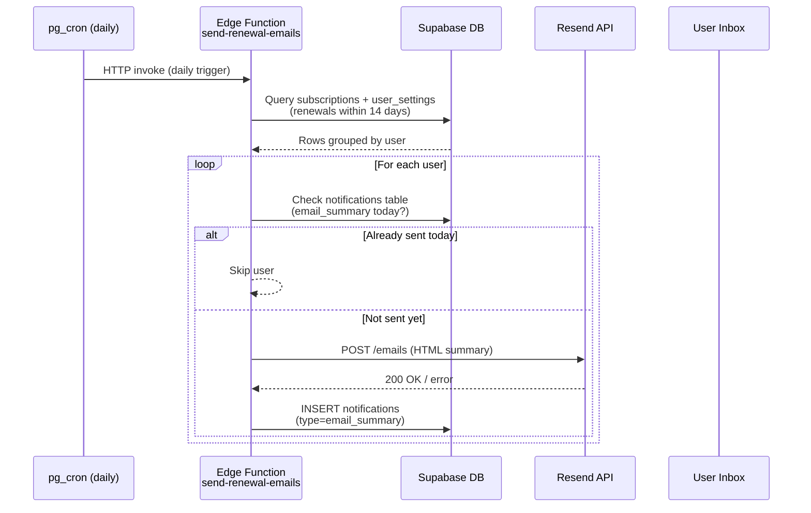
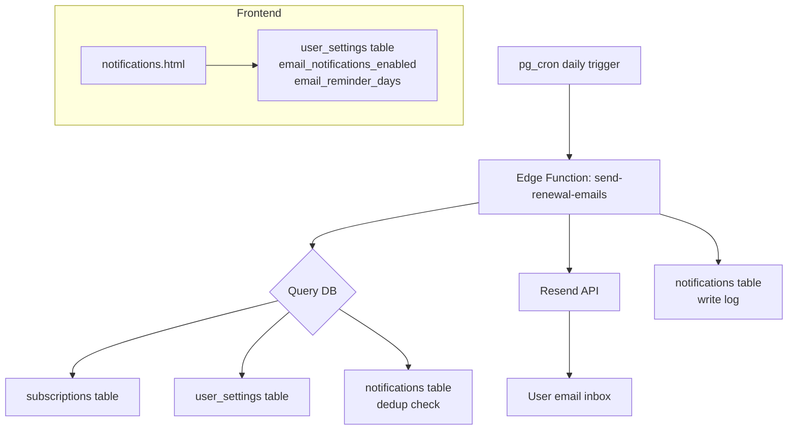

# Design Document: Email Notifications

## Overview

This feature adds automated daily email reminders to SubTrack. A Supabase Edge Function runs on a pg_cron daily schedule, queries upcoming subscription renewals, and sends a single HTML summary email per user via the Resend API. Users control email preferences (enabled/disabled, reminder window) independently from their in-app notification settings, managed from the existing `notifications.html` settings page.

The system is intentionally simple: one Edge Function, one external API call per user per day, one row written to the `notifications` table as a deduplication log.

## Architecture





### Key Design Decisions

- **One function, one schedule**: A single Edge Function invoked by pg_cron avoids complexity of multiple workers or queues.
- **14-day query window**: The function always fetches renewals within 14 days (the max configurable window), then filters per-user by their individual `email_reminder_days` setting. This is one DB query instead of N.
- **Deduplication via `notifications` table**: Reuses the existing table with `type = 'email_summary'` rather than introducing a new table. Idempotent by design.
- **Resend free tier**: Chosen for simplicity; no SMTP configuration needed, just an API key in Edge Function secrets.
- **UTC throughout**: All date comparisons use UTC to avoid timezone-related off-by-one errors.

## Components and Interfaces

### 1. Edge Function: `send-renewal-emails`

**File**: `supabase/functions/send-renewal-emails/index.ts`

**Trigger**: pg_cron schedule — `0 8 * * *` (08:00 UTC daily)

**Responsibilities**:
- Query all active subscriptions with a renewal date within the next 14 days
- Join with `user_settings` to get each user's `email_reminder_days` and `email_notifications_enabled`
- Group qualifying subscriptions by user
- For each user: check dedup log, send email via Resend, write log entry

**Environment variables** (Supabase secrets):
- `RESEND_API_KEY` — Resend API key
- `SUPABASE_URL` — injected automatically
- `SUPABASE_SERVICE_ROLE_KEY` — injected automatically (needed to read auth.users emails)

**Interface — Resend API call**:
```
POST https://api.resend.com/emails
Authorization: Bearer {RESEND_API_KEY}
Content-Type: application/json

{
  "from": "SubTrack <notifications@yourdomain.com>",
  "to": ["user@example.com"],
  "subject": "Your upcoming subscription renewals",
  "html": "<html>...</html>",
  "text": "Plain text fallback..."
}
```

### 2. Frontend: `notifications.html` + `js/notifications.js`

**New UI elements** added to the existing Notification Settings card:

- "Email Notifications" section header
- Toggle: `email_notifications_enabled` (checkbox)
- Dropdown: `email_reminder_days` (3 / 7 / 14 days)

The existing `reminderDays` dropdown is relabelled to "In-app reminder days" to distinguish it.

**Settings persistence**: On save, `js/notifications.js` upserts `user_settings` via the Supabase JS client. On load, it reads back all three fields (`email_notifications_enabled`, `email_reminder_days`, `reminder_days`) and pre-populates the form.

### 3. Database (Supabase Postgres)

Modifications to existing tables via idempotent migration SQL (added to `supabase_schema.sql`):

- `user_settings`: add `email_notifications_enabled`, `email_reminder_days`, `reminder_days`
- `notifications`: extend `type` check constraint to allow `'email_summary'`

## Data Models

### `user_settings` table (additions)

| Column | Type | Default | Description |
|---|---|---|---|
| `email_notifications_enabled` | `boolean` | `true` | Master toggle for email reminders |
| `email_reminder_days` | `integer` | `7` | Days before renewal to send email (3, 7, or 14) |
| `reminder_days` | `integer` | `7` | Days before renewal for in-app notifications (3, 7, or 14) |

### `notifications` table (existing, extended)

| Column | Type | Notes |
|---|---|---|
| `id` | `uuid` | PK |
| `user_id` | `uuid` | FK → auth.users |
| `type` | `text` | Extended to allow `'email_summary'` |
| `title` | `text` | e.g. "Daily email summary sent" |
| `message` | `text` | e.g. "3 renewals included" |
| `read` | `boolean` | default false |
| `created_at` | `timestamptz` | Used for UTC-day dedup check |

### Renewal Date Calculation (TypeScript, Edge Function)

```typescript
function calculateNextRenewal(startDate: string, billingCycle: string): Date | null {
  const start = new Date(startDate + 'T00:00:00Z'); // force UTC
  const today = new Date();
  today.setUTCHours(0, 0, 0, 0);

  let next = new Date(start);
  while (next <= today) {
    if (billingCycle === 'Monthly') {
      next.setUTCMonth(next.getUTCMonth() + 1);
    } else if (billingCycle === 'Yearly') {
      next.setUTCFullYear(next.getUTCFullYear() + 1);
    } else {
      return null; // unsupported billing cycle
    }
  }
  return next;
}
```

### Email HTML Template (structure)

```
Subject: Your upcoming subscription renewals — SubTrack

<html>
  <body>
    <h2>Upcoming Renewals</h2>
    <p>Hi, here are your subscriptions renewing soon:</p>
    <table>
      <tr><th>Name</th><th>Amount</th><th>Renewal Date</th><th>Cycle</th></tr>
      <!-- one row per qualifying subscription -->
    </table>
    <p>Manage your settings at https://subtrackfsd.onrender.com/notifications.html</p>
  </body>
</html>
```

Plain-text fallback lists the same data as line items.

### Migration SQL (idempotent)

```sql
-- user_settings additions
ALTER TABLE user_settings ADD COLUMN IF NOT EXISTS email_notifications_enabled boolean DEFAULT true;
ALTER TABLE user_settings ADD COLUMN IF NOT EXISTS email_reminder_days integer DEFAULT 7;
ALTER TABLE user_settings ADD COLUMN IF NOT EXISTS reminder_days integer DEFAULT 7;

-- notifications: extend type check (drop old constraint, add new one)
ALTER TABLE notifications DROP CONSTRAINT IF EXISTS notifications_type_check;
ALTER TABLE notifications ADD CONSTRAINT notifications_type_check
  CHECK (type IN ('renewal', 'payment', 'system', 'warning', 'success', 'email_summary'));
```


## Correctness Properties

*A property is a characteristic or behavior that should hold true across all valid executions of a system — essentially, a formal statement about what the system should do. Properties serve as the bridge between human-readable specifications and machine-verifiable correctness guarantees.*

### Property 1: Renewal date is always in the future

*For any* subscription with a `start_date` in the past and a `billing_cycle` of `Monthly` or `Yearly`, the value returned by `calculateNextRenewal` shall be strictly greater than today's UTC date.

**Validates: Requirements 2.1, 2.2**

---

### Property 2: Unsupported billing cycle yields no renewal date

*For any* subscription whose `billing_cycle` is not `Monthly` or `Yearly`, `calculateNextRenewal` shall return `null` (and the subscription shall be excluded from processing).

**Validates: Requirements 2.4**

---

### Property 3: Opt-out prevents email; opt-in allows email

*For any* user with `email_notifications_enabled = false`, the notifier shall produce zero outbound emails for that user, regardless of how many qualifying subscriptions they have. Conversely, *for any* user with `email_notifications_enabled = true` and at least one subscription whose renewal date falls within their `email_reminder_days` window, the notifier shall produce exactly one email.

**Validates: Requirements 3.2, 3.3**

---

### Property 4: Query window is bounded to 14 days

*For any* subscription whose next renewal date is more than 14 days from today (UTC), that subscription shall not appear in the set returned by the initial DB query, regardless of any user's `email_reminder_days` setting.

**Validates: Requirements 1.2**

---

### Property 5: Per-user filter uses only `email_reminder_days`

*For any* user whose `email_reminder_days` is set to `N` (3, 7, or 14), only subscriptions with a renewal date within the next `N` days shall be included in their summary email. The value of `reminder_days` (in-app setting) shall have no effect on this filter. When `email_reminder_days` is null, the filter shall behave as if it were 7.

**Validates: Requirements 4.4, 4.5**

---

### Property 6: Email content contains all required fields

*For any* non-empty list of qualifying subscriptions passed to the email builder, the resulting `html` string and `text` string shall each contain the subscription name, renewal amount, renewal date, and billing cycle for every subscription in the list.

**Validates: Requirements 5.3, 5.4**

---

### Property 7: Per-user error isolation

*For any* batch of N users where sending the email for user K fails (Resend returns an error), the notifier shall still attempt to process all remaining users K+1 … N. The failure of one user's email shall not prevent other users from receiving theirs.

**Validates: Requirements 5.5**

---

### Property 8: At most one email per user per UTC day (idempotency)

*For any* user, running the notifier any number of times within the same UTC day shall result in at most one summary email sent to that user and at most one `email_summary` log record inserted for that user on that day.

**Validates: Requirements 5.1, 6.1, 6.2, 6.4**

---

### Property 9: Log record written after successful send

*For any* user to whom a summary email is successfully sent, a record with `type = 'email_summary'` and the correct `user_id` shall exist in the `notifications` table immediately after the send completes.

**Validates: Requirements 6.3**

---

### Property 10: Settings save/load round-trip

*For any* combination of `email_notifications_enabled` (boolean) and `email_reminder_days` (3, 7, or 14) that a user saves, reading those values back from `user_settings` shall return the same values that were written.

**Validates: Requirements 7.2, 7.3**

---

### Property 11: `email_reminder_days` and `reminder_days` are independent

*For any* user settings row, updating `email_reminder_days` shall not change the value of `reminder_days`, and vice versa. The two columns are fully independent.

**Validates: Requirements 4.3**

---

## Error Handling

| Scenario | Behavior |
|---|---|
| Resend API returns 4xx/5xx for a user | Log error with `user_id` and status code; continue to next user |
| Resend API is completely unreachable (network error) | Log failure; exit function; pg_cron will retry on next scheduled run |
| Subscription has unsupported `billing_cycle` | Log warning with subscription id; skip subscription |
| `user_settings` row missing for a user | Use defaults: `email_notifications_enabled = true`, `email_reminder_days = 7` |
| `email_summary` log insert fails after successful send | Log warning; email was sent, dedup may fail on next run (acceptable — user gets at most 2 emails in edge case) |
| Supabase write fails on settings save (frontend) | Display inline error message; do not navigate away; do not clear form |
| Auth session missing on settings page load | Redirect to `login.html` (existing `checkAuth()` behavior) |

## Testing Strategy

### Dual Testing Approach

Both unit tests and property-based tests are required. They are complementary:
- Unit tests cover specific examples, integration points, and error conditions
- Property tests verify universal correctness across randomized inputs

### Property-Based Testing

**Library**: [fast-check](https://github.com/dubzzz/fast-check) (TypeScript/Deno compatible)

Each property test runs a minimum of **100 iterations**.

Each test is tagged with a comment in the format:
`// Feature: email-notifications, Property N: <property text>`

| Property | Test description | Arbitraries |
|---|---|---|
| P1 | `calculateNextRenewal` returns future date | random past dates × `['Monthly', 'Yearly']` |
| P2 | Unsupported cycle returns null | random strings excluding `Monthly`/`Yearly` |
| P3 | Opt-out/opt-in controls email dispatch | random user settings + subscription lists |
| P4 | 14-day query window excludes far-future renewals | random renewal dates > 14 days out |
| P5 | Per-user filter uses `email_reminder_days` only | random `email_reminder_days` + `reminder_days` combos |
| P6 | Email builder includes all required fields | random subscription arrays |
| P7 | Error in one user doesn't stop others | random user batches with injected failures |
| P8 | Idempotency — at most 1 email per user per day | simulate multiple runs same UTC day |
| P9 | Log record exists after successful send | random users + mock Resend success |
| P10 | Settings round-trip | random valid settings values |
| P11 | Column independence | random updates to one column, assert other unchanged |

### Unit Tests

Unit tests focus on:
- **Specific examples**: Monthly renewal from a known start date produces the expected date
- **Edge cases**: `start_date` = today, `start_date` in the far past (many cycles needed), leap year dates
- **Integration**: Frontend `saveNotificationSettings()` calls Supabase upsert with correct payload
- **Error conditions**: Resend 429 rate limit response is handled gracefully; missing `user_settings` row uses defaults
- **Schema**: Inserting a `notifications` row with `type = 'email_summary'` succeeds; inserting with an invalid type fails the check constraint

### Test File Locations

```
supabase/functions/send-renewal-emails/
  index.ts          ← Edge Function implementation
  index.test.ts     ← Unit + property tests (Deno test runner + fast-check)

js/
  notifications.js  ← Modified frontend
  notifications.test.js  ← Unit tests for settings save/load (Jest or Vitest)
```
